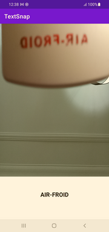

**GitHub Repository README**

# TextSnap - Android Text Recognition App

TextSnap is a simple and intuitive Android app designed to demonstrate the capabilities of Google Vision Text Recognition. With TextSnap, you can easily capture text from images using your device's front camera and view the recognized text in real-time on the app's main screen. It's perfect for developers who want to explore Google Vision's text recognition features or for anyone looking for a straightforward way to extract text from images.

## Features

- **Front Camera Text Recognition**: Utilize your device's front camera to capture images containing text. TextSnap leverages the cameraSource feature to process live images.

- **Real-time Text Display**: The recognized text is instantly displayed on the app's main screen, providing a seamless and responsive user experience.

- **Minimalistic UI**: TextSnap is designed with simplicity in mind. The app features a single screen, making it easy to understand and use.

## Screenshots



## Installation

1. Clone this repository to your local machine using:
   ```
   git clone https://github.com/Renekakpo/TextSnap.git
   ```

2. Open the project in Android Studio.

3. Build and run the app on an Android emulator or a physical device.

## Usage

1. Launch the TextSnap app on your device.

2. Allow the app to access your device's camera.

3. Point the front camera at an image containing text.

4. The recognized text will be displayed in real-time at the bottom of the screen.

## Dependencies

TextSnap uses the Google Vision API for text recognition. The necessary dependencies are already included in the project's `build.gradle` file.

```groovy
implementation 'com.google.android.gms:play-services-vision:20.1.3'
```

## Contributing

Contributions are welcome! If you find any issues or have suggestions for improvements, feel free to open an issue or create a pull request.

## License

This project is licensed under the MIT License - see the [LICENSE](LICENSE) file for details.

---

*Disclaimer: "TextSnap" is a fictional name created for the purpose of this example.*